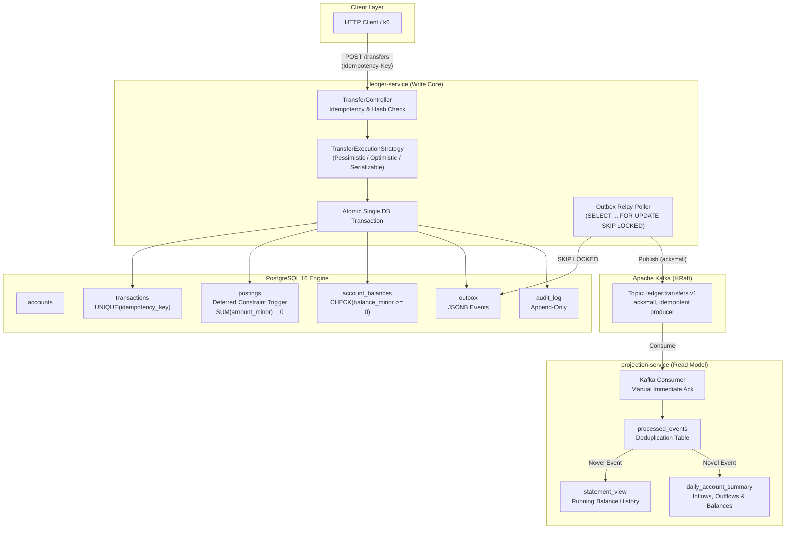

# Ledgerline

> **A mission-critical financial ledger service that moves money between accounts using double-entry bookkeeping, guaranteeing no lost, duplicated, or unbalanced postings under concurrent requests, crashes, network partitions, and message redelivery.**

[](.github/workflows/ci.yml)
[](https://openjdk.org/projects/jdk/21/)
[](https://spring.io/projects/spring-boot)
[](https://www.postgresql.org/)
[](https://kafka.apache.org/)

---

## 1. Problem Statement
Financial software systems cannot tolerate lost money, phantom balances, duplicate executions, or unbalanced ledger entries. Common failure modes in production ledger implementations include:
- **Floating-point inaccuracies** from IEEE 754 representations.
- **Lost updates** caused by uncoordinated read-modify-write patterns under high concurrency.
- **Deadlocks** when competing transactions lock shared accounts in arbitrary order.
- **Dual-write hazards** when updating databases and publishing message queues without an outbox.
- **Duplicate credits/debits** resulting from network timeouts and client retries.

**Ledgerline** solves these fundamental challenges through strict mathematical double-entry invariants, deterministic lock hierarchies, cryptographic request hashing for idempotency, transactional outbox relays, and idempotent event projection.

---

## 2. System Architecture



---

## 3. Core Domain Invariants & Guarantees

### 1. Conservation of Money (Double-Entry Zero-Sum)
Every transfer consists of a balanced pair of postings where debits are signed negative and credits positive:
$$\sum_{i} \text{amount\_minor}_i = 0$$
Enforced at the application service layer **AND** guaranteed by a PostgreSQL deferred constraint trigger (`trg_postings_zero_sum`). If any transaction attempts to commit an unbalanced posting, PostgreSQL aborts the commit.

### 2. Deadlock Elimination via Deterministic UUID Ordering
Pessimistic row locking acquires locks in lexicographically sorted UUID order:
$$\min(\text{fromAccountId}, \text{toAccountId}) \longrightarrow \max(\text{fromAccountId}, \text{toAccountId})$$
Eliminating circular lock dependencies guarantees zero database deadlocks under high concurrency.

### 3. Non-Negative Balances
Every standard `CUSTOMER` account balance is guarded by a PostgreSQL check constraint:
$$\text{CHECK} \ (\text{account\_type} = \text{'OVERDRAFT'} \lor \text{balance\_minor} \ge 0)$$

### 4. Idempotency & Replay Safety
- Primary key / unique constraint on `transactions.idempotency_key`.
- Concurrent duplicate requests block on insertion, and one succeeds while the duplicate returns the original cached result.
- Payload integrity: SHA-256 hash comparison ensures that reusing an idempotency key with different parameters immediately raises `HTTP 422 Unprocessable Entity`.

### 5. Immutability of Postings
Postings are strictly append-only. `UPDATE` and `DELETE` queries are blocked by database triggers. Corrections are performed via reversing transactions.

### 6. Guaranteed At-Least-Once Async Relay
The Outbox Relay poller queries:
```sql
SELECT * FROM outbox 
WHERE published_at IS NULL 
ORDER BY id ASC 
FOR UPDATE SKIP LOCKED 
LIMIT :batchSize
```
Ensures zero message loss, no dual-write hazards, and clean horizontal scaling across multiple relay instances.

---

## 4. Repository Layout

```
ledgerline/
├── README.md                                  # System architecture, invariants, and operations
├── docs/
│   ├── DECISIONS.md                           # Architecture Decision Records (ADRs)
│   └── experiments/
│       ├── 01-isolation.md                    # Isolation benchmarks & lost update proof
│       ├── 02-failure-injection.md            # Chaos & fault injection reports
│       └── 03-cloud-load.md                   # Cloud load test results & cost breakdown
├── ledger-service/                            # Write side: core ledger, API & outbox relay
│   ├── pom.xml
│   └── src/main/java/com/ledgerline/ledger/
│       ├── domain/                            # Account, Balance, Transaction, Posting models
│       ├── repository/                        # Spring Data JDBC repositories
│       ├── service/strategy/                  # 4 Isolation strategies (Variants 0, 1, 2, 3)
│       ├── relay/                             # OutboxRelayPoller (SKIP LOCKED -> Kafka)
│       └── api/                               # REST endpoints & GlobalExceptionHandler
├── projection-service/                        # Read side: balance projection & statement view
│   ├── pom.xml
│   └── src/main/java/com/ledgerline/projection/
│       ├── consumer/                          # Kafka consumer with manual offset commit
│       ├── model/                             # StatementViewEntry, DailyAccountSummary
│       └── service/                           # Idempotent projection engine
├── bench/                                     # Workloads & benchmarking tools
│   ├── k6-isolation-test.js                   # Low vs High contention isolation test
│   ├── k6-cloud-load.js                       # Sustained high-volume cloud load test
│   └── smoke-test.sh                          # End-to-end integration smoke script
├── deploy/                                    # Infrastructure & deployment
│   ├── compose.yaml                           # Local stack: Postgres, Kafka, Prometheus, Toxiproxy
│   ├── Dockerfile.ledger
│   ├── Dockerfile.projection
│   ├── main.tf                                # Single-file Terraform for minimal AWS cloud
│   └── prometheus/prometheus.yml              # Metrics scraping configuration
└── .github/workflows/
    ├── ci.yml                                 # CI automated test pipeline
    └── deploy.yml                             # Cloud deployment on release tag
```

---

## 5. Quickstart: Running Locally

### Prerequisites
- Java 21+
- Docker & Docker Compose

### Start the Infrastructure & Services
```bash
# 1. Start PostgreSQL, Kafka, Toxiproxy, Prometheus, Grafana, and Ledgerline services
cd deploy
docker compose up -d

# 2. Verify health
curl -s http://localhost:8080/actuator/health | jq .
curl -s http://localhost:8081/actuator/health | jq .

# 3. Run automated smoke tests
cd ../bench
bash smoke-test.sh
```

---

## 6. Running Tests

```bash
# Run unit, concurrency, isolation, and property tests
./mvnw clean test

# Run specific test suites:
./mvnw test -Dtest=DatabaseConstraintInvariantTest    # Database triggers & constraints
./mvnw test -Dtest=ConcurrentTransferStressTest        # 50 threads x transfers invariant check
./mvnw test -Dtest=IsolationExperimentTest             # Lost updates in Variant 0 vs 1-3
./mvnw test -Dtest=DoubleEntryPropertyTest             # jqwik 1000 randomized property tests
./mvnw test -Dtest=ProjectionDeduplicationTest         # Kafka redelivery deduplication
```

---

## 7. Isolation Experiment Results (Summary)

| Metric | Variant 0 (Broken) | Variant 1 (Pessimistic) | Variant 2 (Optimistic) | Variant 3 (Serializable) |
| :--- | :--- | :--- | :--- | :--- |
| **Concurrency Model** | Read-then-write | `FOR UPDATE` (sorted UUIDs) | Version check + retry | SSI + retry on `40001` |
| **Balance Invariant** | **FAILS** — `IsolationExperimentTest.demonstrateLostUpdateAnomalyInVariant0` asserts drift reproduces in a committed test run | **PASSES** — zero drift, asserted in CI | **PASSES** — zero drift, asserted in CI | **PASSES** — zero drift, asserted in CI |
| **High-contention RPS / p95 / p99** | 1.8/s / 20,328.5ms / 22,290.2ms | 258.9/s / 170.9ms / 226.0ms | 60.4/s / 1,383.0ms / 2,353.8ms | 50.0/s / 2,341.7ms / 3,403.8ms |
| **High-contention failure rate** | 89.3% | 0% | 13.5% | 13.4% |

Correctness rows are backed by tests that run in CI on every push. Performance rows are from one real local k6 run against `docker compose -f deploy/compose.yaml` (50 low-contention / 3 high-contention accounts, 20 VUs, 30s per regime) — see [docs/experiments/01-isolation.md](docs/experiments/01-isolation.md) §4 for the full low+high tables, environment caveats, and the committed raw JSON under `bench/results/` each number is computed from.

---

## 8. Failure Testing Matrix (Summary)

- **Worker Crash Mid-Publish**: Relay crashes after publishing to Kafka before marking row published $\to$ event re-published on next poll. Verified against a real Kafka Testcontainer via `AsyncFailureAndResilienceTest.shouldRepublishAfterSimulatedCrashBetweenSendAndMarkPublished`; the dedup half is verified separately by `ProjectionDeduplicationTest` (not yet one end-to-end run through a live consumer — see 02-failure-injection.md §3.1).
- **Message Redelivery**: Consumer crashes after DB commit before Kafka offset commit $\to$ redelivery detected, projection updated exactly once. Verified by `ProjectionDeduplicationTest` against a real Postgres Testcontainer.
- **Kafka Outage**: Broker unreachable $\to$ transfers commit synchronously to DB; outbox backlog accumulates; backlog drains completely once the broker recovers. Verified against a real, paused-then-unpaused Kafka Testcontainer broker (not a mock) in `AsyncFailureAndResilienceTest.shouldAccumulateOutboxBacklogWhenKafkaIsDownAndDrainAfterRecovery`.
- **Partial Failure / DB Outage**: Toxiproxy-based DB outage testing is **not implemented** — the dependency is declared in `pom.xml` but no test uses it yet. Not claimed as verified.
- **Property-Based Testing**: jqwik-generated random traces executed against the real `TransferService` + a real Postgres database (not an in-memory oracle) $\to$ zero invariant violations across all committed runs. See `DoubleEntryPropertyTest`.

*Full details in [docs/experiments/02-failure-injection.md](docs/experiments/02-failure-injection.md).*

---

## 9. Observability & Metrics

Prometheus metrics exposed at `http://localhost:8080/actuator/prometheus`:
- `ledger.transfers.latency`: Latency histogram tagged by `variant` and `outcome`.
- `ledger.transfers.outcomes`: Counter of transfer outcomes (`success`, `insufficient_funds`, `idempotent_replay`, `idempotency_conflict`, `error`).
- `ledger.outbox.backlog.size`: Real-time gauge of unpublished outbox events.
- `ledger.outbox.oldest_unpublished_age_seconds`: Age in seconds of oldest unpublished event.

**Not yet implemented**: consumer-lag metric, and lock-wait/serialization-failure/deadlock counters (`pg_stat_database`). Listed here as gaps, not as shipped metrics.

---

## 10. Known Limitations & Future Work
1. **Single-Currency Transfers**: Currently, transfers require matching currencies between accounts. Multi-currency support can be implemented via an explicit FX posting pair with an intermediary exchange account.
2. **Reversals & Holds**: Two-phase authorisations (auth $\to$ capture) can be modeled as temporary balance holds preceding final postings.
3. **Partitioned Outbox**: For workloads exceeding 50,000 transfers/sec, outbox table partitioning by hash or date allows concurrent bulk drain workers.
